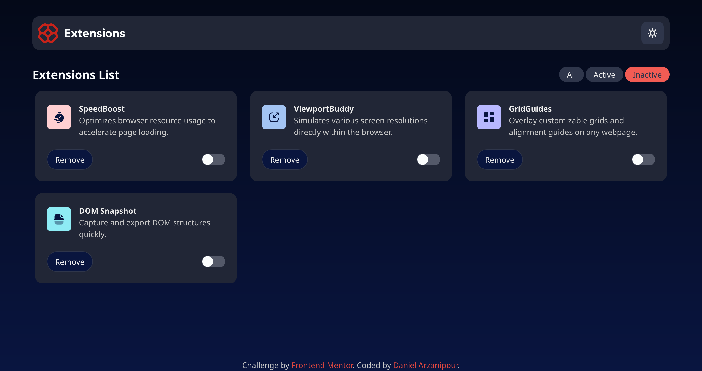

# Frontend Mentor - Browser Extensions Manager UI

## Welcome! 👋

Thanks for checking out my solution to the **Browser Extensions Manager** challenge from [Frontend Mentor](https://www.frontendmentor.io). This was a fun and insightful project where I explored advanced frontend architecture, accessibility, and layout composition.

---

## Table of Contents

- [Overview](#overview)
- [Built With](#built-with)
- [Features](#features)
- [Project Structure](#project-structure)
- [What I Learned](#what-i-learned)
- [Useful Resources](#useful-resources)
- [Links](#links)

---

## Overview

This project is a responsive, accessible browser extensions manager interface. I focused on **Clean Architecture**, **CUBE CSS**, and **Every Layout** principles to organize styles and logic cleanly.

**Key goals:**

- Semantic, accessible HTML
- Scalable CSS architecture (CUBE + BEM)
- Maintainable JS code following separation of concerns

---

## Built With

- HTML5
- CSS (CUBE architecture + BEM naming)
- Vanilla JavaScript
- [Vite](https://vitejs.dev/)
- [Every Layout](https://every-layout.dev/)
- [Granim.js](https://sarcadass.github.io/granim.js/)
- [Clean Frontend Architecture](https://bespoyasov.me/blog/clean-architecture-on-frontend/)
- Variable Fonts

---

## Features

Users can:

- ✅ Toggle extensions between active and inactive
- ✅ Filter by status (active/inactive)
- ✅ Remove extensions from the list
- ✅ Switch between light/dark themes
- ✅ Experience responsive layout for all device sizes
- ✅ See focus/hover states for all interactive elements

---

## What I Learned

- **Using Every Layout to compose or create all the layouts**

- **CUBE CSS**: Component-first styling with predictable utilities

- **Clean Architecture**:

  - Domain logic separated from UI
  - No HTML-in-JS; dynamic content managed via `data.json`

- **Theming**: Switched themes using `[data-theme]` + CSS custom properties

- **Gradients**: CSS can't animate them directly; used `Granim.js`

---

## Useful Resources

- [Clean Frontend Architecture – Alex Bespoyasov](https://bespoyasov.me/blog/clean-architecture-on-frontend/)
- [Accessible Toggle Buttons – Josh Collinsworth](https://joshcollinsworth.com/blog/accessible-toggle-buttons)
- [Every Layout](https://every-layout.dev/)
- [Granim.js](https://sarcadass.github.io/granim.js/)

---

## Links

- 🔗 **Live Site**: [https://fastidious-maamoul-676685.netlify.app/](https://fastidious-maamoul-676685.netlify.app/)
- 💾 **GitHub Repo**: [https://github.com/Frontend-Mentor-Projects-Daniel/Browser-extension-manager](https://github.com/Frontend-Mentor-Projects-Daniel/Browser-extension-manager)
